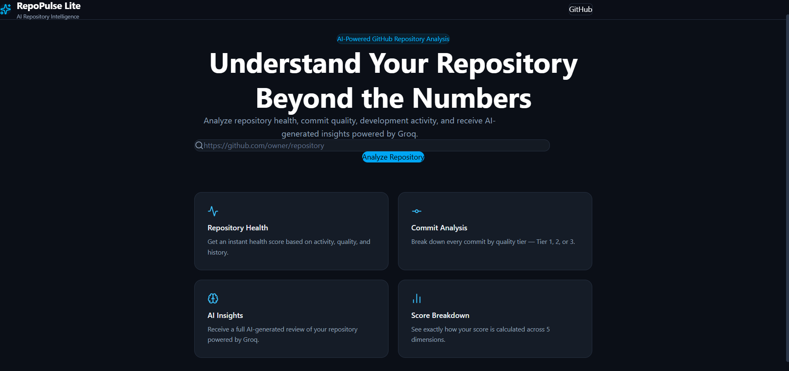
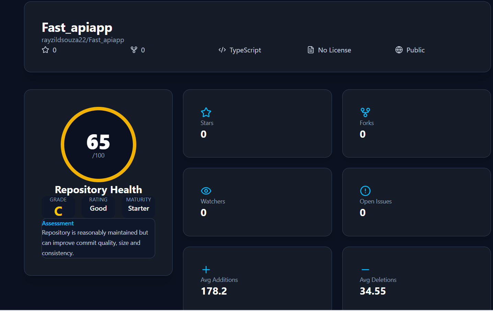
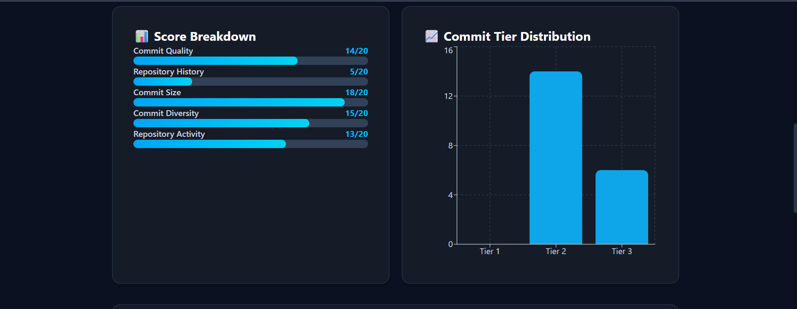
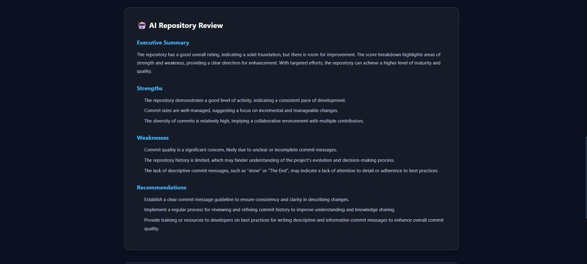
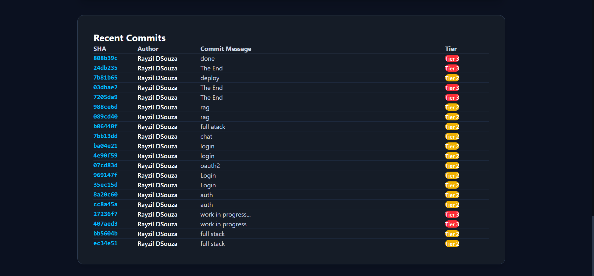

# RepoPulse Lite 🚀

An AI-powered GitHub repository analysis platform built with **FastAPI**, **React**, and the **Groq API**. RepoPulse Lite analyzes public GitHub repositories by evaluating repository metadata, commit activity, repository statistics, and repository health to generate AI-powered insights through an interactive analytics dashboard.

---

# Features

- Analyze any public GitHub repository
- Repository Health Score (0–100)
- Repository Grade & Rating
- Repository Maturity Assessment
- AI-generated Executive Summary
- Commit Quality Analysis
- Repository Statistics
- Commit Tier Distribution
- Score Breakdown
- Interactive Dashboard
- Responsive User Interface
- Error Handling

---

# Tech Stack

## Frontend

- React
- TypeScript
- Vite
- Tailwind CSS
- Framer Motion
- Axios
- Recharts

## Backend

- Python
- FastAPI
- Pydantic
- HTTPX
- GitHub REST API
- Groq API

---

# Project Structure

```text
RepoPulse-Lite/
│
├── frontend/
├── backend/
├── README.md
├── DEVELOPMENT.md
└── spec.md
```

---

# Installation

## Clone Repository

```bash
git clone https://github.com/rayzildsouza22/RepoPulse-Lite.git

cd RepoPulse-Lite
```

---

## Backend Setup

```bash
cd backend

python -m venv venv

# Windows
venv\Scripts\activate

# Linux/macOS
source venv/bin/activate

pip install -r requirements.txt

uvicorn app.main:app --reload
```

---

## Frontend Setup

```bash
cd frontend

npm install

npm run dev
```

---

# Environment Variables

Create a `.env` file inside the **backend** directory.

```env
GITHUB_TOKEN=your_github_token
GROQ_API_KEY=your_groq_api_key
```

---

# API

### Endpoint

```
POST /api/v1/analyze
```

### Example Request

```json
{
  "repository_url": "https://github.com/openai/openai-python"
}
```

---

# Screenshots

## Home Page



## Repository Dashboard



## Repository Analytics



## AI Executive Summary



## Recent Commit Analysis



---

# Deployment

**Frontend:** Vercel

**Backend:** Render

---

# Live Demo

**Frontend**

https://repo-pulse-lite-mauve.vercel.app

**Backend API**

https://repopulse-lite-w57h.onrender.com

**API Documentation**

https://repopulse-lite-w57h.onrender.com/docs

---

# Documentation

The repository also includes:

- **README.md** – Project overview, setup instructions, and deployment details.
- **DEVELOPMENT.md** – Development methodology, AI tooling audit, environment setup, deployment notes, and implementation workflow.
- **spec.md** – System architecture, application workflow, API specification, and repository analysis logic.

---

# Future Enhancements

- Repository comparison
- Historical repository analytics
- Contributor analytics
- Authentication
- Persistent repository history
- PDF report export
- CSV export
- Dark/Light mode
- Advanced repository metrics

---

# Author

**Rayzil Vionna DSouza**